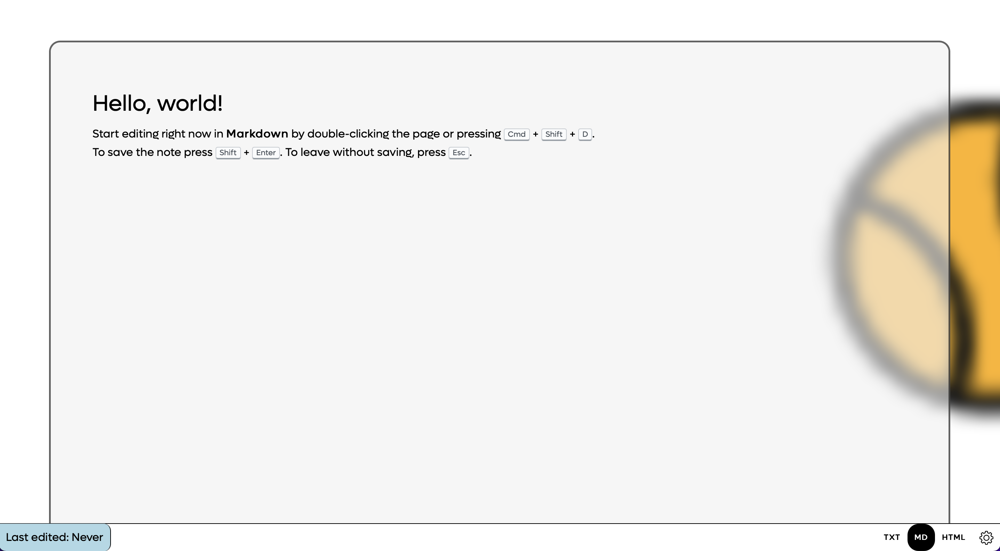
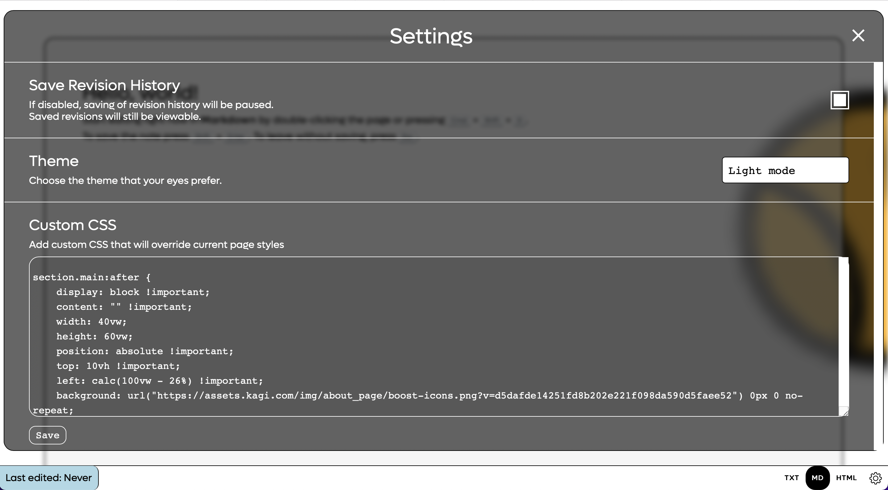

# Theme-for-notes-page-on-up-and-coming-browser
This is a theme for a notes page in an up and coming browser.
Usage
--
In the browser open the preferences, in there select New Tab Page Opens With, and in the drop down choose notes
From there simply open a new tab, click on the settings icon in the bottom right, you will see a section for custom CSS, copy and paste the contents of main.css into that field. Click save and enjoy the theme :)

Screenshots
--

